# Portfolio Tracker for Google Sheets

AI-powered investment tracking that lives entirely in Google Sheets — no hosting, no database, no subscription. Paste (or screenshot) your brokerage statements and Claude parses them into structured holdings and a realized-P&L trade journal.

Built as two Google Apps Script modules bound to a single spreadsheet:

| Module | File | What it does |
|---|---|---|
| **Holdings Tracker** | [`src/Code.gs`](src/Code.gs) | Open positions and unrealized gain/loss across multiple brokerage accounts. Paste a positions export or drop a screenshot; account columns are detected/created automatically. |
| **Trade Journal** | [`src/TradeJournal.gs`](src/TradeJournal.gs) | Realized gain/loss log of closed trades (specific-lot basis) with an AI-assisted thesis / exit-notes journal and a configurable-window performance summary. |

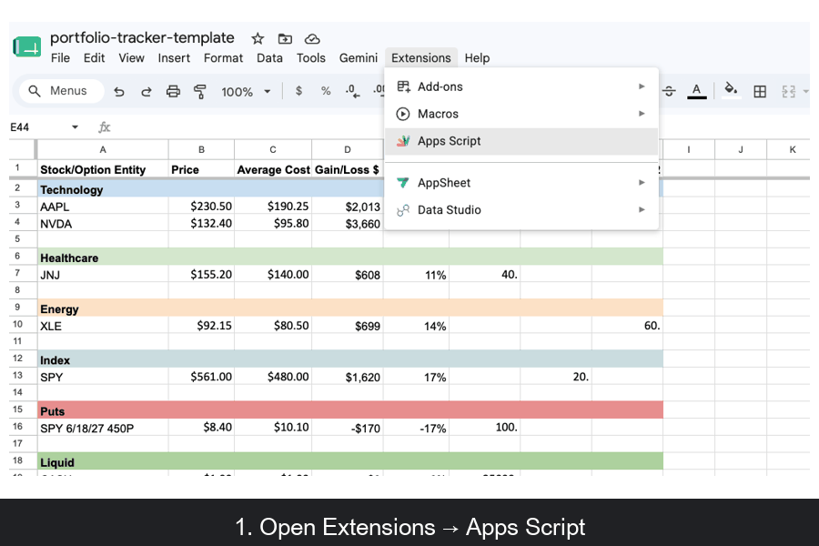

## Features

- **Parse anything the broker gives you** — pasted text, CSV/TSV drag-and-drop, or screenshots, from any brokerage. Claude (Anthropic API) normalizes it all to structured rows; you review every parsed row in a dialog before anything is written.
- **Multi-account** — tag each paste with the account it came from (Schwab, Fidelity, Robinhood, IRA…); accounts become columns/labels automatically.
- **Duplicate-safe imports** — re-pasting a report that overlaps what's already journaled can't double-log: rows matching an existing ticker + open date + close date + qty are skipped, and the import dialog shows the last journaled close date so you know how far back to capture.
- **Voice-dictated journaling** — talk through your trades in one freeform dump ("LAC was a tip from a friend, cut it at a loss…"); the AI matches each remark to the right journal row and fills in thesis / exit notes.
- **Trade summary on demand** — win rate, net/gross P&L, avg win/loss, short- vs long-term split, worst tickers — over any lookback window (30/90/180/365 days, YTD, all-time).
- **Security-conscious by design** — your Anthropic API key is stored in Apps Script `PropertiesService` (server-side script properties), never in the sheet, the code, or this repo. Your financial data never leaves Google + Anthropic's API.

## Quick start (~5 minutes)

**1. Get the template.** Upload [`template/portfolio-tracker-template.xlsx`](template/portfolio-tracker-template.xlsx) to Google Drive and open it with Google Sheets (**File → Save as Google Sheets**). It ships with fictional example data and an Instructions tab.

**2. Open the script editor** via **Extensions → Apps Script**:

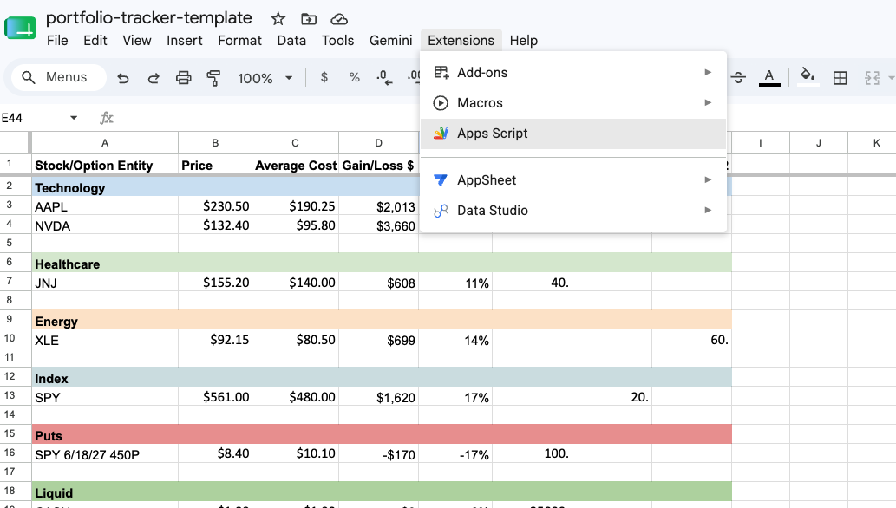

**3. Paste in the Holdings Tracker.** The editor opens with an empty stub — replace it with the full contents of [`src/Code.gs`](src/Code.gs):

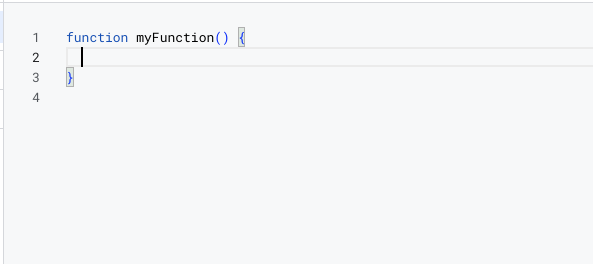
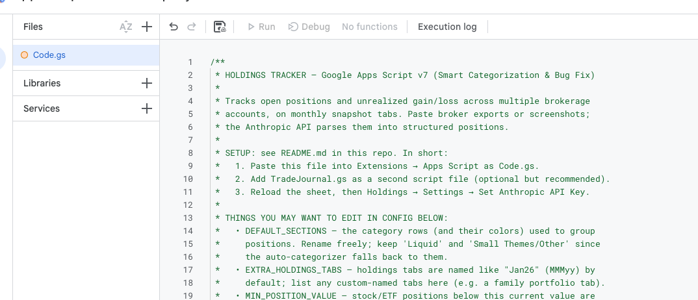

**4. Add the Trade Journal.** Click **＋ next to Files → Script**, name it `TradeJournal`, and paste in [`src/TradeJournal.gs`](src/TradeJournal.gs). Save.

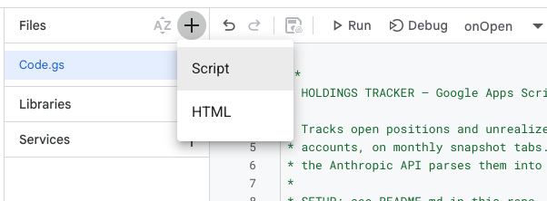

**5. Reload the spreadsheet.** Two new menus appear — **📊 Holdings** and **📉 Trade Journal**:

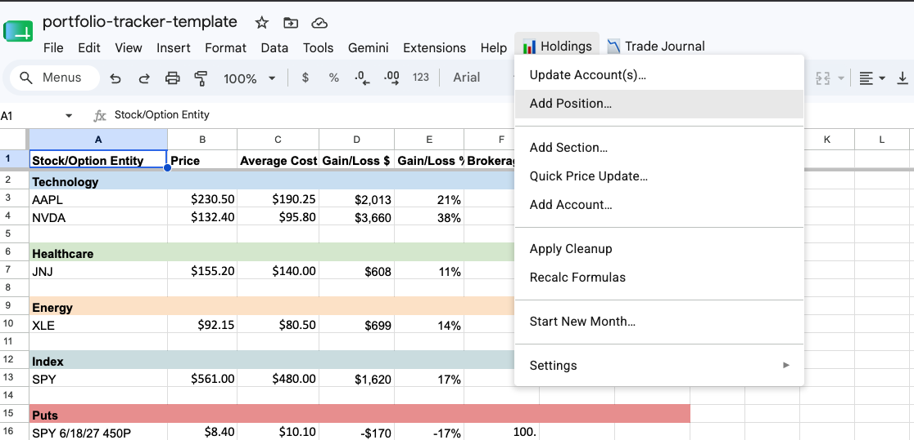

**6. Authorize on first run.** The first time you use a menu item, Google shows an "unverified app" warning — expected, since *you* are the developer of a private script. Click **Advanced → Go to Portfolio Tracker (unsafe)**, then grant the three permissions (edit this spreadsheet, call the Anthropic API, show dialogs):

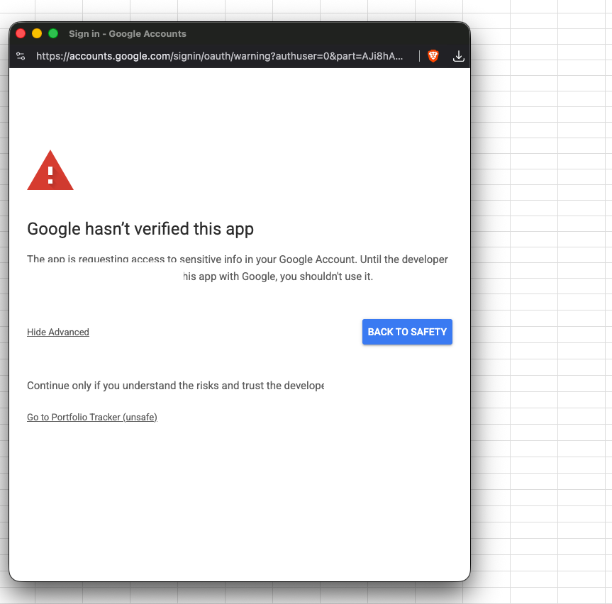
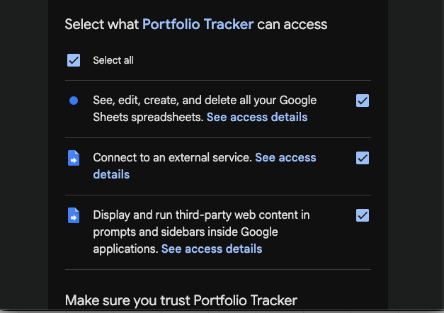

**7. Rename the accounts to yours.** Account names live in **row 1** of the holdings tab, starting at column **F**. Click a header cell and type over it — `Brokerage 1` → `Schwab`, `Roth IRA` → `My Roth`, and so on:

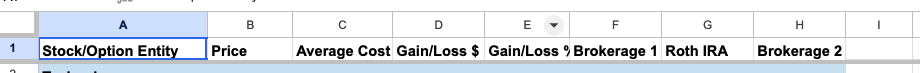

- Every import dialog's account dropdown picks the new names up automatically, and the hidden cost-basis helper re-syncs its headers on the next menu action — your cost data stays aligned.
- Account names are matched exactly — only the script's own Total columns ("Total Qty", "Total Value $", "% of Portfolio") are skipped, so names like "Total Return Fund" or "Value Partners" work fine.
- To **add** an account, use **Holdings → Add Account…** instead of inserting a column manually, so the helper sheet gets the matching column.

**8. Set your API key** (table below), then try **Holdings → Update Account(s)…** — pick the account, paste a broker export or drop a screenshot, and hit **Parse with AI**:

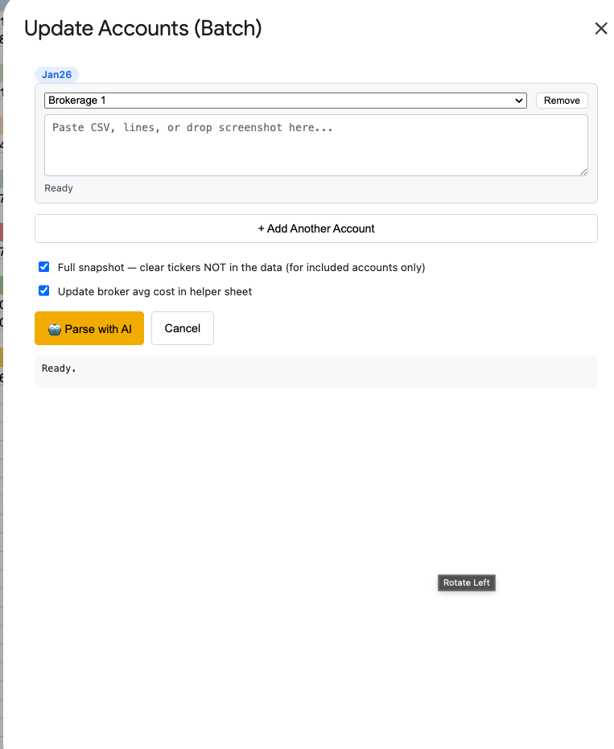

## What you need to set

| Setting | Where | Notes |
|---|---|---|
| **Anthropic API key** (required) | Holdings → Settings → Set Anthropic API Key | Create one at [console.anthropic.com](https://console.anthropic.com) (API keys → Create Key). Stored in Apps Script Script Properties — never in the sheet or this repo. The default model is Claude Haiku, so a typical import costs well under a cent. |
| **Your account names** | Row 1 of the holdings tab, columns F onward | Rename `Brokerage 1` / `Roth IRA` / `Brokerage 2` to your real accounts, or use Holdings → Add Account…. These names become the choices in every import dialog. |
| **Your categories** | The colored section rows | Rename/add via Holdings → Add Section…. Keep `Liquid` and `Small Themes/Other` — the AI auto-categorizer falls back to them. Defaults live in `CONFIG.DEFAULT_SECTIONS` in `Code.gs`. |
| **Tab naming** | Holdings tabs | Must be `MMMyy` (e.g. `Jan26`). Holdings → Start New Month… rolls a snapshot forward. Custom-named tabs can be whitelisted in `CONFIG.EXTRA_HOLDINGS_TABS`. |
| **Minimum position size** (optional) | `CONFIG.MIN_POSITION_VALUE` in `Code.gs` | Stock positions under this current value (default $1,000) are ignored on import; options are exempt. |

Detailed usage notes live in the header comments of each script file.

## The Trade Journal

Closed trades get their own log: **📉 Trade Journal → Log Closed Trades…** parses your broker's realized gain/loss report the same way (paste, CSV, or screenshot). Re-importing an overlapping report is safe — rows already in the journal are skipped automatically, and the dialog shows the last journaled close date so you know how far back to capture:

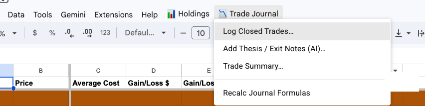
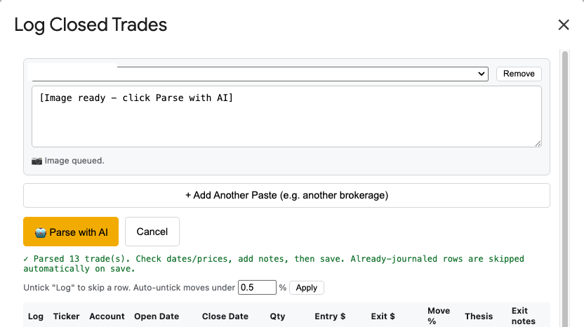

Then talk through your trades with **📉 Trade Journal → Add Thesis / Exit Notes (AI)…** — one freeform dump, in any order; the AI matches each remark to the right journal row.

> **💡 Dictation tip:** Google Sheets has **no microphone button** of its own — voice input comes from your operating system, so don't go looking for a mic icon in the dialog.
> - **Mac (Chrome, Brave, Safari — any browser):** click into the notes box, then use the menu bar: **Edit → Start Dictation**. Shortcut: press the **🎤 / Fn (globe) key twice**. (First time only: enable it in System Settings → Keyboard → Dictation.)
> - **Windows:** click into the box and press **Win + H**.
>
> Speak naturally, punctuation and filler included — the AI cleans up dictation artifacts when it writes the journal notes.

## Sharing your sheet with others

- **To give someone their own tracker (recommended):** share your sheet (or a sanitized copy) as **Viewer** and have them use **File → Make a copy**. The Apps Script code is bound to the spreadsheet and **copies with it** — they get the full app instantly, no pasting. Script Properties do **not** copy, so your API key stays private; they set their own key on their copy.
- **To collaborate on one sheet:** share with **Editor** access. The menus work for them too (each person authorizes on their own first use) — but be aware they'll be using **your** Anthropic API key, and any editor can open Extensions → Apps Script and read it. Only do this with people you'd hand the key to.
- **Viewer access alone** can't run the scripts — viewing the numbers is fine, importing isn't.

## Architecture notes

- Plain Apps Script + HtmlService dialogs — zero external dependencies, zero build step.
- The Trade Journal module is deliberately additive: it reuses the Holdings module's config, API key, and helpers but never modifies it. One line added to `onOpen()` wires up the menu.
- Cost-basis method: specific-lot, with same-day lots (same ticker, same open date, same close date) merged into one row. No FIFO/average-cost re-matching.
- Journal rows use live sheet formulas for cost basis, proceeds, P&L, hold days, and term — so manual edits recompute instantly.

## Disclaimer

This is a personal tracking tool, not financial or tax advice. Verify realized-gain figures against your broker's official tax documents.

## License

[AGPL-3.0](LICENSE)
